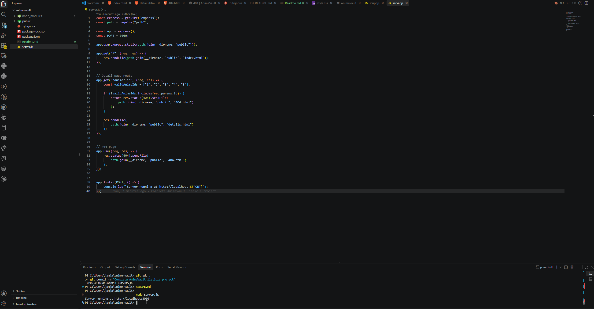

# AnimeVault

## Overview

AnimeVault is a list-based web application created for **CodePath WEB103 - Advanced Web Development, Unit 1 Project 1: Listicle Part 1**.

The application allows users to browse a collection of anime recommendations. Each anime is displayed as a card containing basic information, and users can click **View Details** to open a dedicated page containing additional information about that anime.

The application was built using vanilla HTML, CSS, and JavaScript with an Express.js backend and PicoCSS for styling.

---

## Features

### Required Features

The following required functionality is completed:

- [x] The web app uses only HTML, CSS, and JavaScript without a frontend framework
- [x] The front page of the web app is functional and appropriately styled
- [x] The web app displays a title
- [x] The website displays at least five unique list items
- [x] Each list item includes at least three displayed attributes
- [x] Each list item has a corresponding detail page
- [x] Users can click on each item to view a detailed version
- [x] Detail pages display all available information for the selected anime
- [x] The web app serves a custom 404 page when no matching route is found
- [x] The webpage is styled using PicoCSS

### Stretch Features

The following stretch functionality is implemented:

- [x] List items are displayed as responsive cards instead of a basic list
- [x] Responsive styling allows the layout to adjust to different screen sizes

---

## Anime Included

AnimeVault currently includes:

1. Attack on Titan
2. Death Note
3. Demon Slayer
4. Jujutsu Kaisen
5. Fullmetal Alchemist: Brotherhood

Each anime contains shared attributes including:

- ID
- Title
- Genre
- Year
- Rating
- Description
- Image

---

## Technologies Used

- HTML
- CSS
- JavaScript
- Node.js
- Express.js
- PicoCSS
- Git
- GitHub

---

## Project Structure

```text
anime-vault/
│
├── public/
│   ├── index.html
│   ├── details.html
│   ├── 404.html
│   ├── style.css
│   └── script.js
│
├── .gitignore
├── demo.gif
├── package.json
├── package-lock.json
├── README.md
└── server.js
```

---

## Running the Project Locally

### 1. Clone the repository

```bash
git clone YOUR-GITHUB-REPOSITORY-URL
```

### 2. Enter the project directory

```bash
cd anime-vault
```

### 3. Install dependencies

```bash
npm install
```

### 4. Start the Express server

```bash
node server.js
```

### 5. Open the application

Open your browser and navigate to:

```text
http://localhost:3000
```

---

## Routes

### Home Page

```text
/
```

Displays all available anime.

### Anime Detail Pages

```text
/anime/1
/anime/2
/anime/3
/anime/4
/anime/5
```

Each route displays detailed information about the corresponding anime.

### 404 Page

Invalid URLs or anime IDs display a custom **404 - Page Not Found** page.

For example:

```text
/anime/99
```

or

```text
/random
```

---

## How It Works

The Express server handles incoming requests and serves the appropriate HTML files.

The home page uses JavaScript to loop through the anime data and dynamically create a card for each anime.

When a user selects **View Details**, the anime's ID is included in the URL.

For example:

```text
/anime/1
```

JavaScript reads the ID from the URL and finds the corresponding anime data to display on the details page.

---

## Video Walkthrough

Here's a walkthrough of the implemented features:



---

## Notes

One challenge during development was creating one detail page that could display different anime depending on the route.

This was handled by using an Express route parameter:

```javascript
app.get("/anime/:id", ...)
```

The ID is then read from the URL and used to find the corresponding anime.

Another consideration was structuring each anime with the same attributes. This creates a consistent data structure that can later be moved into a database.

---

## Future Improvements

Possible future improvements include:

- Connecting AnimeVault to a database
- Adding more anime
- Adding search functionality
- Adding genre filters
- Allowing users to sort anime by rating or year
- Improving animations and card interactions