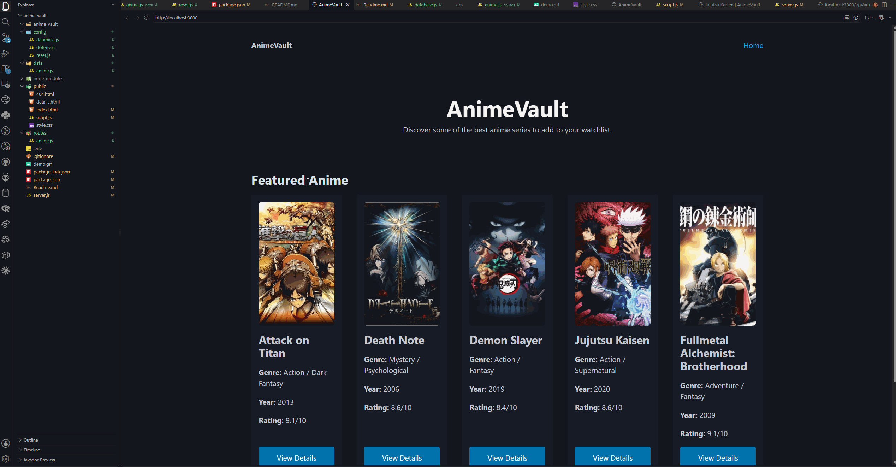

# AnimeVault

## Overview

AnimeVault is a list-based web application created for **CodePath WEB103 - Advanced Web Development, Unit 2 Project 2: Listicle Part 2**.

The application allows users to browse a collection of anime recommendations. Each anime is displayed as a card containing basic information, and users can click **View Details** to open a dedicated page with additional information.

For Project 2, AnimeVault was refactored to retrieve its anime data from a **PostgreSQL database hosted on Render** instead of storing the list directly in the frontend JavaScript.

The application uses vanilla HTML, CSS, and JavaScript on the frontend, with Node.js, Express.js, PostgreSQL, and PicoCSS.

---

## Features

### Required Features

The following required functionality is completed:

- [x] The web app uses only HTML, CSS, and JavaScript without a frontend framework
- [x] Data is supplied to the app using a Render PostgreSQL database
- [x] The web app is connected to a Render PostgreSQL database
- [x] The database contains an appropriately structured table for the list items

### Additional Features

- [x] Displays at least five unique anime
- [x] Each anime displays multiple attributes
- [x] Each anime has its own detail page
- [x] Users can click an anime to view its full information
- [x] Data is retrieved from PostgreSQL through Express API routes
- [x] Custom 404 page
- [x] Responsive card layout
- [x] PicoCSS styling

### Stretch Features

- [ ] Users can search for anime using a specific attribute

---

## Anime Included

AnimeVault currently includes:

1. Attack on Titan
2. Death Note
3. Demon Slayer
4. Jujutsu Kaisen
5. Fullmetal Alchemist: Brotherhood

Each anime contains the following database attributes:

- ID
- Title
- Genre
- Year
- Rating
- Description
- Image

---

## Technologies Used

- HTML
- CSS
- JavaScript
- Node.js
- Express.js
- PostgreSQL
- Render PostgreSQL
- PicoCSS
- Git
- GitHub

---

## Project Structure

```text
anime-vault/
│
├── config/
│   ├── database.js
│   ├── dotenv.js
│   └── reset.js
│
├── data/
│   └── anime.js
│
├── routes/
│   └── anime.js
│
├── public/
│   ├── index.html
│   ├── details.html
│   ├── 404.html
│   ├── style.css
│   └── script.js
│
├── .env
├── .gitignore
├── demo1.gif
├── package.json
├── package-lock.json
├── README.md
└── server.js
```

> The `.env` file contains database credentials and is excluded from GitHub using `.gitignore`.

---

## Database

AnimeVault uses a PostgreSQL database hosted on Render.

The database contains an `anime` table with the following structure:

| Column | Type |
| --- | --- |
| id | SERIAL PRIMARY KEY |
| title | VARCHAR |
| genre | VARCHAR |
| year | INTEGER |
| rating | VARCHAR |
| description | TEXT |
| image | VARCHAR |

The original anime data is stored in `data/anime.js` and is used to seed the PostgreSQL database.

The frontend does not directly read from this file. Instead, it retrieves the anime through the Express API.

---

## API Routes

### Get All Anime

```text
GET /api/anime
```

Returns all anime stored in the PostgreSQL database.

Example:

```text
http://localhost:3000/api/anime
```

### Get One Anime

```text
GET /api/anime/:id
```

Returns one anime using its database ID.

Example:

```text
http://localhost:3000/api/anime/1
```

---

## Application Routes

### Home Page

```text
/
```

Displays all anime retrieved from PostgreSQL.

### Anime Detail Page

```text
/anime/:id
```

Examples:

```text
/anime/1
/anime/2
/anime/3
/anime/4
/anime/5
```

Each page displays detailed information about the selected anime.

### 404 Page

Invalid application routes display a custom **404 - Page Not Found** page.

---

## How It Works

### 1. PostgreSQL Database

Anime data is stored in the `anime` table inside a PostgreSQL database hosted on Render.

### 2. Express Backend

The Express server connects to PostgreSQL using the `pg` package.

Database credentials are stored as environment variables:

```text
PGDATABASE
PGHOST
PGPASSWORD
PGPORT
PGUSER
```

### 3. API

Express provides API routes for retrieving anime data:

```text
/api/anime
/api/anime/:id
```

### 4. Frontend

The frontend uses JavaScript's `fetch()` function to request data from the API.

For example:

```javascript
fetch("/api/anime")
```

The returned database data is then used to dynamically create the anime cards.

When a user visits a detail page such as:

```text
/anime/4
```

the frontend requests:

```text
/api/anime/4
```

and displays the returned anime.

---

## Running the Project Locally

### 1. Clone the Repository

```bash
git clone https://github.com/KDawTech/anime-vault.git
```

### 2. Enter the Project Directory

```bash
cd anime-vault
```

### 3. Install Dependencies

```bash
npm install
```

### 4. Create Environment Variables

Create a `.env` file in the root directory:

```env
PGDATABASE=your_database_name
PGHOST=your_external_database_hostname
PGPASSWORD=your_database_password
PGPORT=5432
PGUSER=your_database_username
```

Do not commit the `.env` file to GitHub.

### 5. Create and Seed the Anime Table

```bash
npm run reset
```

This creates the `anime` PostgreSQL table and inserts the anime data.

### 6. Start the Server

```bash
npm start
```

### 7. Open AnimeVault

Navigate to:

```text
http://localhost:3000
```

---

## Video Walkthrough

Here's a walkthrough of the implemented features:



---

## Challenges

One challenge was refactoring AnimeVault so the frontend no longer relied on a hard-coded anime array.

In Project 1, anime data was stored directly inside the frontend JavaScript.

For Project 2, the data was moved into PostgreSQL. Express API routes now query the database and return the results to the frontend.

Another challenge was configuring the Render PostgreSQL connection using environment variables while keeping database credentials private.

---

## What I Learned

Through this project, I practiced:

- Creating a PostgreSQL table
- Seeding a PostgreSQL database
- Connecting Node.js and Express to PostgreSQL
- Using environment variables for database credentials
- Writing SQL queries from an Express application
- Creating API routes
- Retrieving database data with `fetch()`
- Separating frontend and backend responsibilities

---

## Future Improvements

Possible future improvements include:

- Adding more anime
- Adding search functionality
- Adding genre filters
- Sorting anime by rating or year
- Allowing users to add new anime
- Allowing users to edit or delete anime
- Improving animations and card interactions
